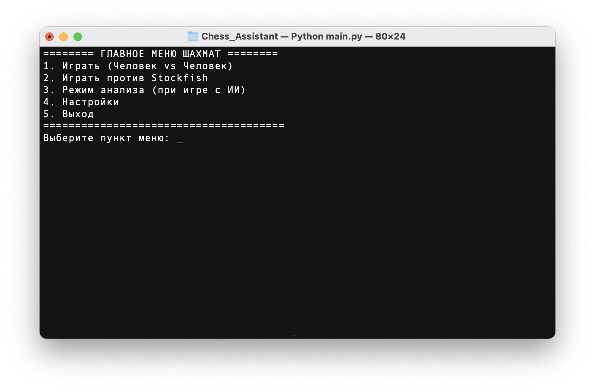
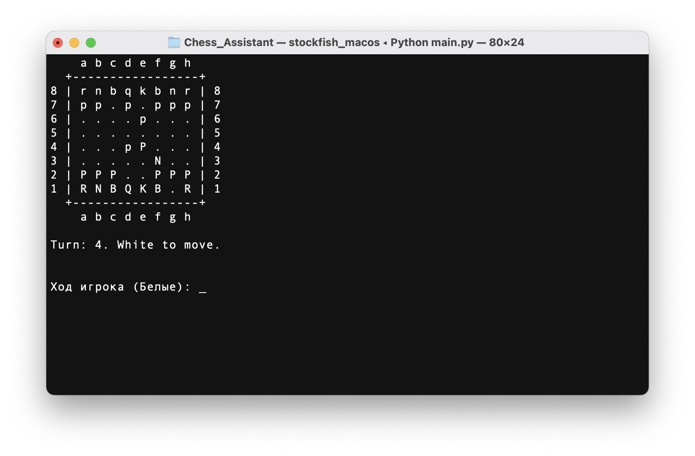

# ♟️ Chess Assistant: Минималистичные консольные шахматы

Репозиторий все еще довольно сырой, если нашли писать в тг @samoilov_ma

**Chess Assistant** — это полнофункциональный и минималистичный консольный шахматный клиент. Он позволяет играть в шахматы в режиме "человек против человека", а также бросить вызов одному из сильнейших в мире шахматных движков — **Stockfish**. Есть возможность сыграть с самообученным ИИ (в разработке) и проводить анализ партий (в разработке).


| []		| []            |
|:-------------------------------------------------:|:--------------------------------------------------:|
|              Стартовое меню.                      |              Пример игрового интерфейса            |

## 🚀 Основные возможности

*   **Классическая шахматная логика:** Полная поддержка всех правил, включая рокировку, взятие на проходе и превращение пешки.
*   **Игра против ИИ:** Интеграция с движком **Stockfish** с настраиваемым уровнем сложности.
*   **Гибкий интерфейс:**
    *   **Мультиязычная поддержка:**  
		Русский (ru) 🇷🇺 | English (en) 🇬🇧 | Español (es) 🇪🇸 | Français (fr) 🇫🇷 | 中文 (zh) 🇨🇳
    *   Переворот доски для комфортной игры за черных.
    *   Настраиваемые правила, такие как подтверждение хода и "авто-королева".
*   **Надежность:** Код покрыт набором тестов для проверки ключевых механик, таких как правила ничьей (троекратное повторение, правило 50 ходов, недостаток материала).
*   **Кроссплатформенность:** Работает на Windows, macOS и Linux.

### 2. Клонирование репозитория

Откройте терминал или командную строку и выполните:
```bash
git clone https://github.com/Samoilov2004/Chess_Assistant.git
cd Chess_Assistant
```
*(Замените URL на адрес вашего репозитория на GitHub)*

### 3. Установка зависимостей

Рекомендуется использовать виртуальное окружение:
```bash
# Создание виртуального окружения
python3 -m venv venv

# Активация
# Windows
venv\Scripts\activate
# macOS / Linux
source venv/bin/activate
```

Установите все необходимые библиотеки:
```bash
pip install -r requirements.txt
```

**Для пользователей macOS и Linux:** необходимо выдать файлу стокфиша права на исполнение. Выполните в терминале:
    ```bash
    chmod +x engine/stockfish_macos
    ```
    Или в зависимости от системы
    ```bash
    chmod +x engine/stockfish_linux
    ```

Если не помогло - дайте права на исполнение из настроек.

### 4. Запуск игры

Все готово! Для запуска игры выполните:
```bash
python3 main.py
```
Вы увидите главное меню, где сможете выбрать режим игры или зайти в настройки.

## 🧪 Тестирование

Проект содержит набор модульных тестов для проверки корректности игровой логики. Для их запуска выполните команду из корневой директории проекта:
```bash
python3 -m unittest discover tests
```

## Что предстоит сделать?
#### Main
- [ ] Несколько видов оформления фигур, пока говно нечитаемое
- [ ] ИИ хз когда подвезем, не скоро
- [ ] Режим Анализ тож только после обучения модельки

#### Конкретные таски
- [x] Тесты падают на простом ходе че такое, поправить
- [x] При взятии на проходе старая пешка не удаляется
- [x] добавить правило повторения позиция и логику запоминания прошлых позиций
- [x] добавить правило ничьи по недостатку фигур 
- [ ] тесты на недостатке фигур падают
- [ ] добавить красивенький интерфейс фигур, а не из терминала запускаться
- [ ] подумать над тем как партии импортировать и как хранить
- [ ] сделать доку по доске
	- [x] Сделать пробную доку на сфинксе
	- [ ] Чет красивше
- [ ] draw_repetition в locales добавить
- [ ] draw_insufficient_material Результат: Ничья (Недостаточно материала).
- [ ] добавить "settings_flip_board": "3. Переворот доски за черных (Текущий: {status})",
- [ ] "settings_auto_queen": "4. Авто-королева (Текущий: {status})",
- [ ] "settings_back": "5. Назад в меню",
- [ ] "status_on": "Вкл",
- [ ] "status_off": "Выкл"
- [ ] тесты для locales автоматические написать
- [ ] выбор типа фигур 
- [x] автоферзь в настройках 

"choose_skill_level": "Выберите сложность ИИ (0-20, стандартно 5): ",
"choose_color_prompt": "За кого вы хотите играть? (б/белые или ч/черные): ",
"ai_thinking": "ИИ думает...",
"ai_makes_move": "ИИ делает ход",
"ai_error": "ИИ не смог сделать ход. Игра прервана."