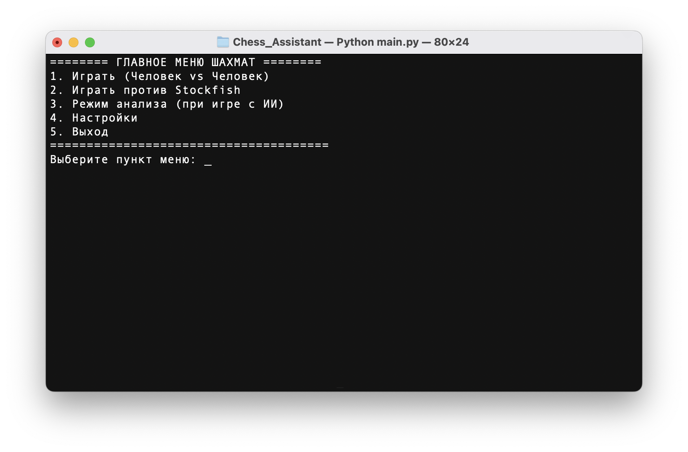
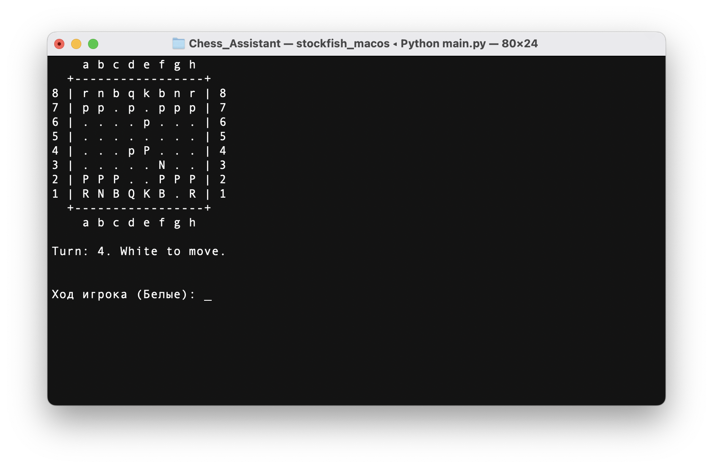

# ♟️ Terminal Chess: Минималистичные консольные шахматы

## 🔎 Описание

Репозиторий все еще довольно сырой, если нашли ошибки - писать в тг @samoilov_ma

**Terminal Chess** — это полнофункциональный и минималистичный консольный шахматный клиент. Он позволяет играть в шахматы в режиме "человек против человека", а также бросить вызов одному из сильнейших в мире шахматных движков — **Stockfish**. Есть возможность сыграть с самообученным ИИ (в разработке) и проводить анализ партий (в разработке).

*   **Классическая шахматная логика:** Полная поддержка всех правил, включая рокировку, взятие на проходе и превращение пешки.
*   **Игра против ИИ:** Интеграция с движком **Stockfish** с настраиваемым уровнем сложности.
*   **Гибкий интерфейс:**
    *   **Мультиязычная поддержка:**  
		Русский (ru) 🇷🇺 | English (en) 🇬🇧 | Español (es) 🇪🇸 | Français (fr) 🇫🇷 | 中文 (zh) 🇨🇳
    *   Переворот доски для комфортной игры за черных.
    *   Настраиваемые правила, такие как подтверждение хода и "авто-королева".
*   **Надежность:** Код покрыт набором тестов для проверки ключевых механик, таких как правила ничьей (троекратное повторение, правило 50 ходов, недостаток материала).
*   **Кроссплатформенность:** Работает на Windows, macOS и Linux.


| 	    	|               |
|:-------------------------------------------------:|:--------------------------------------------------:|
|              Стартовое меню.                      |              Пример игрового интерфейса            |


## 🚀 Режимы игры

*   **1. Играть (Человек vs Человек)**
	Игра в которой вы управляете и белыми, и черными фигурами.
*   **2. Играть против Stockfish**
	Игра против Стокфиша (уровень 1-10)
*   **3. Тренировочная игра (с анализом)**
    Игра с указанием 3 сильнейших ходов и возможностью вернуть ход. Игра за белых/черных/управление обоими цветами.
*   **4. Шахматы Фишера** В РАЗРАБОТКЕ
    Игра против стокфиша (уровень 1-10) в шахматы фишера.

## ⚙️ Возможности настроек
В скобках показаны дефолтные настройки
1. Язык (Текущий: Русский 🇷🇺 )
2. Стиль фигур (Unicode)
3. Переворот доски (Вкл)
4. Подсветка последнего хода (Вкл)
5. Показывать съеденные фигуры (Выкл)
6. Подтверждение хода (Вкл)
7. Авто-королева (Выкл)

## 🖥 Использование

Откройте терминал или командную строку и выполните:
```bash
git clone https://github.com/Samoilov2004/TerminalChess.git
cd ./Chess_Assistant
```

Рекомендуется использовать виртуальное окружение:
```bash
# Создание виртуального окружения
python3 -m venv venv

# Активация
# Windows
venv\Scripts\activate
# macOS / Linux
source venv/bin/activate
```

Установите все необходимые библиотеки:
```bash
pip install -r requirements.txt
```

**Для пользователей macOS и Linux:** необходимо выдать файлу стокфиша права на исполнение. Выполните в терминале:
    ```bash
    chmod +x engine/stockfish_macos
    ```
    Или в зависимости от системы
    ```bash
    chmod +x engine/stockfish_linux
    ```

Если не помогло - дайте права на исполнение из настроек.

### Запуск игры

Все готово! Для запуска игры выполните:
```bash
python3 main.py
```
Вы увидите главное меню, где сможете выбрать режим игры или зайти в настройки.

## 🧪 Тестирование

Проект содержит набор модульных тестов для проверки корректности игровой логики. Для их запуска выполните команду из корневой директории проекта:
```bash
python3 -m unittest discover tests
```

## Что предстоит сделать?
#### Конкретные таски
#### Таски по V2 (Перешли на новую архитектуру и весь src переписал)
- [ ] Проверить правила 50 ходов и троекратное повторение
- [ ] Новое ReadMe
- [ ] Ошибка когда не хочу сохранять партию, то просто ловится баг
- [ ] Заменить в меню слова выход в меню на продолжить иногда, а то путаница
- [ ] Если убрать подсветку последнего хода, то она не убирается
- [ ] Цвета будто неправильно иногда стоят 
- [ ] Написать тесты на настройки